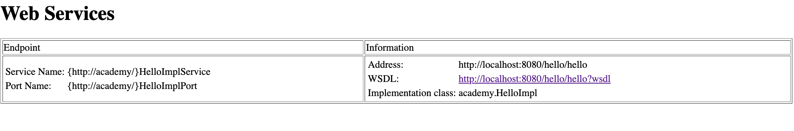
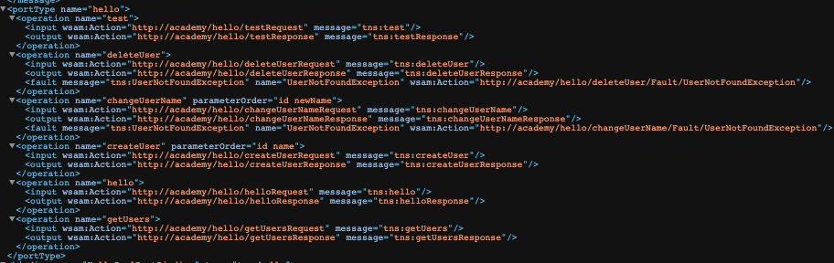
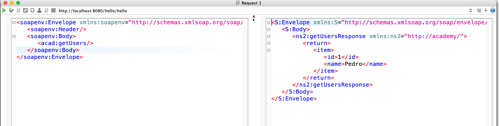
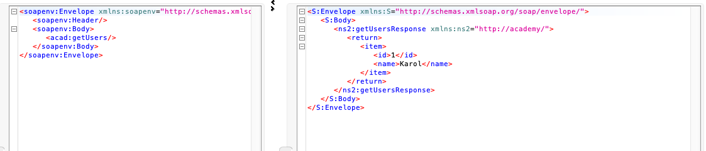
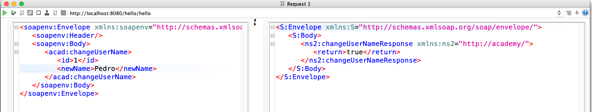
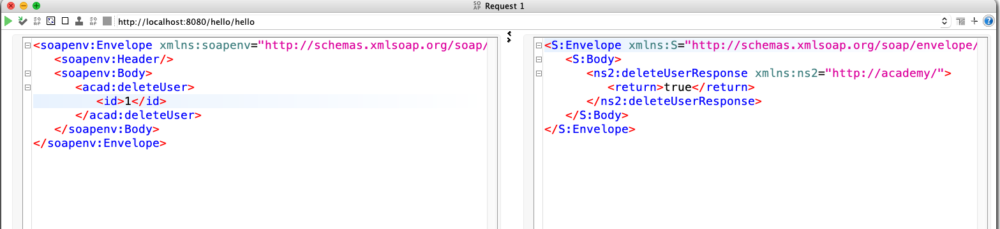
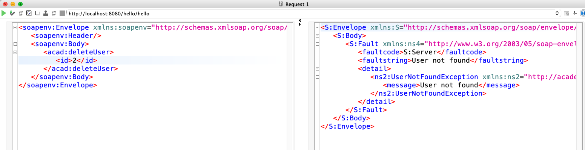

# Academy Project

1. [Project structure and building](#Structure)
2. [WebService](#WebService)
3. [SoapUI Tests](#SoapUI)
4. [Client](#Client)

---
## Structure
    - academy-parent (maven parent module)
        - academy-webservice (maven submodule)
        - academy-client (maven submodule)

Submodule declarations in [pom.xml](pom.xml) (parent):
```xml
  <modules>
  	<module>academy-webservice</module>
  	<module>academy-client</module>
  </modules>
```
## Build system

The web service builds a *.war* file that deploys to Tomcat (or any servlet server). It also generates a *.jar* file so academy-client can access it's classes (academy-client needs the service interface and user model in order to execute operations). 

This is achieved through the maven-war plugin by specifying the *attachClasses* parameter ([academy-webservice/pom.xml](academy-webservice/pom.xml)):

```xml
<plugin>
	<groupId>org.apache.maven.plugins</groupId>
	<artifactId>maven-war-plugin</artifactId>
	<version>3.3.1</version>
	<configuration>
		<failOnMissingWebXml>true</failOnMissingWebXml>
		<attachClasses>true</attachClasses>
	</configuration>
</plugin>

```

Then academy-client injects the generated *.jar* via a Maven dependency ([academy-client/pom.xml](academy-client/pom.xml)):
```xml
<dependency>
  	<groupId>academy-parent</groupId>
	<artifactId>academy-webservice</artifactId>
	<version>0.0.1-SNAPSHOT</version>
	<classifier>classes</classifier>
</dependency>
```

Maven will generate the *.war* file via mvn package or mvn install.


---
## WebService

Every operation is declared in [Hello.java](academy-webservice/src/main/java/academy/Hello.java)

### Tomcat Server Entry


### WSDL


---- 

### SoapUI

Create user



Get users



Change user name



Delete user



Exception handling



## Client

The client service is implemented in [ClientService.java](academy-client/src/main/java/academyclient/ClientService.java)

It is configured to retrieve the service information from http://localhost:8080/hello/hello?wsdl through the following notation:

```java
@WebServiceClient(targetNamespace = "http://localhost:8080/", wsdlLocation = "http://localhost:8080/hello/hello?wsdl", name = "HelloImplService")
```

It performs all the operations that are defined in the service via it's [Main](academy-client/src/main/java/academyclient/Main.java) class.

Client generation example:

```java
ClientService es = new ClientService(new URL("http://localhost:8080/hello/hello?wsdl"), new QName("http://academy/", "HelloImplService"));

Hello h = es.getHelloPort();

```